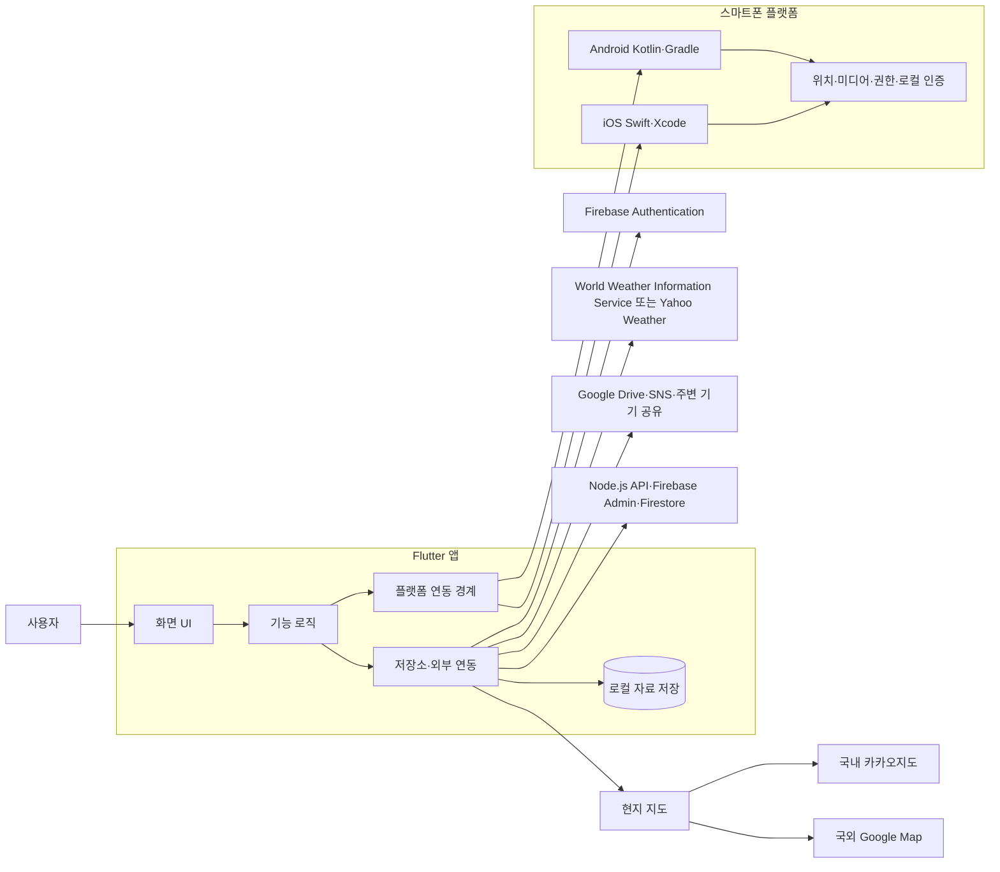
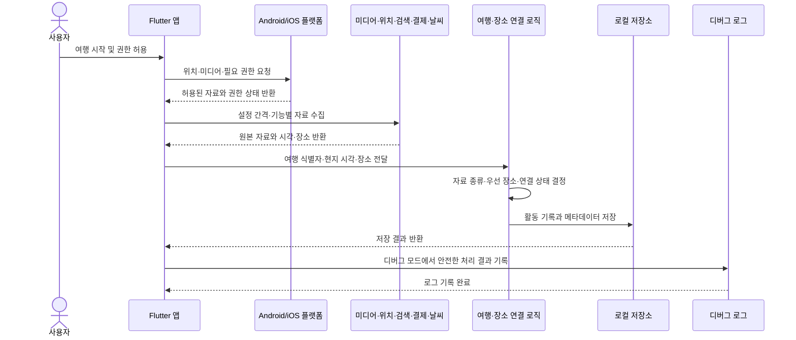
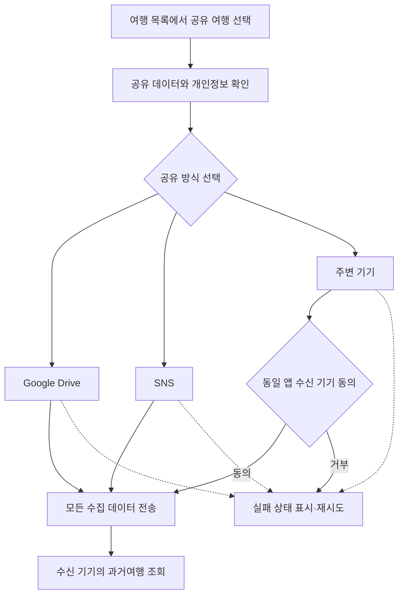

# 여행기록 앱 기술 아키텍처 다이어그램

## 변경 이력

| 버전 | 날짜 | 작성(수정)자 | 변경 내용 |
|---|---|---|---|
| v1.0 | 2026-09-23 | tokec | 기술 아키텍처와 자료 수집 시퀀스 다이어그램 작성 |
| v1.1 | 2026-09-23 | tokec | 사진첩·지오코딩·지도 제스처의 현재 플랫폼 경계 반영 |
| v1.2 | 2026-09-23 | tokec | Firebase Admin·Firestore 백엔드 연결 구조 추가 |
| v1.3 | 2026-09-25 | tokec | Android 카카오지도 네이티브 경로·마커 초기화와 로컬 우선 현재 구조 반영 |

## 1. 작성 기준

- 공통 기능은 Flutter와 Dart로 처리한다.
- Android와 iOS 전용 기능은 플랫폼 연동 경계로 격리한다.
- 로컬 저장을 기본으로 하고 원격 인증과 외부 공유는 선택 기능으로 연결한다.
- 국내 현지 지도는 카카오지도, 국외 현지 지도는 Google Map을 사용한다.
- 백엔드는 Node.js·Firebase Admin SDK·Firestore를 사용하며, 독립 REST API가 전달받은 ID 토큰의 사용자 `uid`를 자료 소유권으로 사용한다. 현재 Flutter 앱의 원격 인증·동기화 호출은 연결하지 않았다.
- 현재 Android 구현은 Kakao 지도, `photo_manager` 사진첩, `geocoding` 도시 좌표 조회, `SharedPreferencesAsync` 로컬 저장을 사용하며 사진 원본은 삭제하지 않는다.
- Android 지도는 지도 생성 시 기본 마커 레이어를 만든 뒤 마커와 네이티브 ShapeLayer 폴리라인을 추가한다. 지도 SDK 밖에 별도 Flutter 경로 레이어를 두지 않는다.
- 지도 제스처는 Flutter 부모 스크롤과 분리해 네이티브 지도 뷰가 핀치·드래그를 처리한다.

## 2. 전체 기술 구조

## 3. 자료 수집과 여행 연결 시퀀스

자료의 종류별 수집 위치와 시각을 확인하고 여행·활동 기록에 연결하는 흐름이다.

### 연결 규칙

- 모든 자료는 `여행 식별자`와 현지 시각을 기준으로 연결한다.
- 장소는 현지 지도 저장 장소, 결제 장소, 사진·동영상 장소, 노트 작성 장소를 우선 사용한다.
- 이동경로는 설정된 간격의 GPS 위치 기록으로 구성한다.
- 위치가 없거나 정확도가 낮으면 연결 상태를 표시하고 자료를 버리지 않는다.
- 로그에는 비밀번호, 토큰, 원본 메시지, 개인정보가 포함된 파일 경로를 기록하지 않는다.

## 4. 공유 흐름

주변 기기 공유는 Wi-Fi 또는 Bluetooth로 통신 가능하고 동일 앱이 설치된 기기를 대상으로 한다. 수신 동의 전에는 자료를 전송하지 않는다.

## 5. 구현 경계

| 경계 | 담당 |
|---|---|
| Flutter UI | 화면, 입력, 상태 표시, 반응형 레이아웃 |
| 기능 로직 | 여행·활동·메모·공유 흐름과 검증 |
| 저장소 | 로컬 자료 저장, 조회, 실패 상태 보존 |
| 플랫폼 연동 | Android·iOS 권한, 백그라운드 위치, 미디어, 로컬 인증 |
| 외부 연동 | Firebase Authentication, Node.js API·Firestore, 현지 지도, 날씨, 공유 서비스 |
| 디버그 로그 | 디버그 모드의 안전한 처리 결과 기록 |

새 플랫폼 API나 외부 서비스는 해당 경계에 추가하며, 화면 위젯에서 직접 호출하지 않는다.
