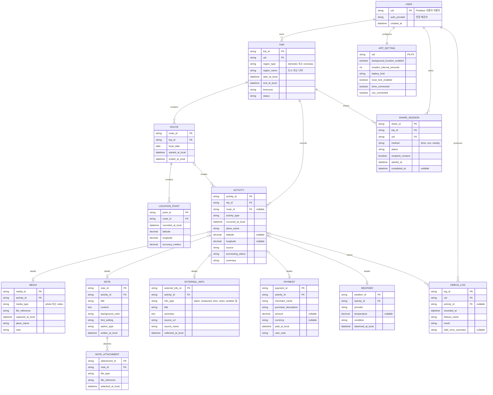

# 여행기록 앱 논리 ERD

## 변경 이력

| 버전 | 날짜 | 작성(수정)자 | 변경 내용 |
|---|---|---|---|
| v1.0 | 2026-09-23 | tokec | 여행기록 앱 논리 ERD 작성 |
| v1.1 | 2026-09-23 | tokec | 여행 사진 메타데이터와 원본 보존·숨김 정책 반영 |
| v1.2 | 2026-09-23 | tokec | Firestore 원격 저장과 백엔드 API 소유권 기준 반영 |
| v1.3 | 2026-09-25 | tokec | 실제 로컬 Trip 모델과 논리 ERD의 후속·미연결 범위를 구분 |

## 1. 작성 기준

- `docs/3-domain-definition.md`, `docs/4-prd.md`, `docs/5-user-scenario.md`를 기준으로 작성한다.
- 데이터 저장소와 DBMS는 아직 확정되지 않았으므로 논리 모델로 표현한다.
- 모바일 앱은 로컬 우선으로 동작하며, 현재 Flutter 로컬 모델은 `Trip`, `RoutePoint`, `PhotoMetadata`, `WeatherRecord`다. 백엔드 API는 Firebase Authentication으로 사용자를 식별하고 Firestore에 원격 자료를 저장하지만 Flutter 클라이언트에는 아직 연결하지 않았다.
- 파일은 데이터베이스에 직접 저장하지 않고 로컬 식별자 또는 안전한 외부 참조를 저장한다.
- 인증 토큰, 비밀번호, 원본 메시지와 같은 민감한 값은 모델에 포함하지 않는다.

## 2. 논리 ERD

## 3. 관계와 제약

이 ERD는 목표 논리 모델이다. 현재 앱의 JSON 저장은 `TRIP` 안에 GPS·사진 메타데이터·날씨 목록을 포함하는 단순 구조이며, `ACTIVITY`, `NOTE`, `PAYMENT`, `EXTERNAL_INFO`, `SHARE_SESSION`은 백엔드·후속 기능을 위한 논리 모델이다.

### 3.1 사용자와 여행

- `USER.uid`는 Firebase `uid`와 동일한 사용자 식별자다.
- 한 사용자는 여러 여행을 가질 수 있다.
- 여행 자료는 `TRIP.uid` 소유권으로 접근을 제한한다.
- `APP_SETTING`은 사용자당 하나만 가진다.

### 3.2 경로와 활동

- 한 여행은 여러 날짜별 `ROUTE`를 가질 수 있다.
- `LOCATION_POINT`는 설정된 수집 간격의 GPS 위치 기록이다.
- `ACTIVITY.route_id`는 위치와 연결할 수 없으면 비워둘 수 있다.
- 활동의 연결 기준은 여행 식별자, 현지 시각, 장소다.
- 낮은 위치 정확도나 장소 누락은 자료 삭제가 아니라 처리 상태로 보존한다.

### 3.3 활동 상세 자료

- `ACTIVITY`는 공통 시각·장소·출처·처리 상태를 가진다.
- 사진·동영상, 메모, 외부 정보, 결제, 날씨의 상세 데이터는 각각 별도 테이블로 분리한다.
- 사진 메타데이터는 자산 식별자, 현지 촬영 시각, 촬영 위치, 원본 파일 위치를 저장하고 원본 파일과 분리한다.
- 사진 메타데이터 삭제는 원본 파일 삭제가 아니며, 여행별 숨김 자산 식별자를 별도로 관리한다.
- 메모는 여러 첨부파일을 가질 수 있으므로 `NOTE_ATTACHMENT`를 별도로 둔다.
- 외부 정보의 날씨 자료와 `WEATHER`는 원본 외부 정보와 구조화된 날씨 상세를 구분하기 위해 별도로 유지할 수 있다.

### 3.4 공유

- `SHARE_SESSION`은 여행 단위 공유의 시작·동의·완료 상태를 기록한다.
- 주변 기기 공유는 동일 앱이 설치된 수신 기기의 동의가 있어야 전송한다.
- 공유 대상은 선택한 여행의 모든 수집 자료이며, 공유 전에 사용자 확인을 받는다.
- 실제 파일 전송 데이터와 인증 정보는 저장소·공유 방식에 맞게 별도로 보호한다.

## 4. 저장 방식 결정 전 확인사항

- 로컬 저장소의 파일 메타데이터와 실제 파일 보존 정책
- Firestore 원격 동기화 범위와 모바일 클라이언트 연결 시점
- 여행 공유 시 대용량 미디어의 전송 방식과 재시도 정책
- 삭제·복구·백업과 데이터 마이그레이션 정책
- DBMS, 인덱스, 암호화, 보존 기간

현재 DBMS가 확정되지 않았으므로 이 문서에 대응하는 `docs/schema.sql`은 생성하지 않았다. DBMS와 테이블 저장 방식이 결정되면 ERD와 DDL을 함께 갱신한다.
